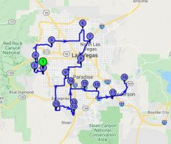

Path Finder App with Dijkstra's algorithm



## Overview

Get lost at the middle of the traffic? No problem, here comes Path Finder App. By using Dijkstra's algorithm is App will automatically generate the most optimal route for user to get to the destination.

The Solving Mazes programs takes the maze input text files and input from the user. The user can see:
- the maze displayed without a solution
- the maze displayed with the solution, marked with `*` (if there is a solution)
- if the maze is unsolvable.

## Usage

When the user runs the program after downloading the code, they must compile the code and then execute the program with the name of the maze file that they would like to input, for example:
```java
$ javac *.java
$ java Maze maze.txt
```
Where `maze.txt` is the name of the maze file which user want (for the example below, it is `maze2.txt`).

After upon execution, the user is prompted whether or not they want to display the solution:
```
$ Do you want to display the solution?
$ Type "yes" or "no"
```
If the user types "yes," the maze is displayed with the solution squares marked with a `*`:
```
$ This is a solution!
$ +-----+-----+-----+-----+
$ |                       |
$ |  S                    |
$ |                       |
$ +     +-----+-----+     +
$ |     |           |     |
$ |  *  |           |     |
$ |     |           |     |
$ +     +-----+-----+-----+
$ |                       |
$ |  *     *     *     F  |
$ |                       |
$ +-----+-----+-----+-----+
```
If the user types "no," then the maze is displayed without the solution: 
```
$ Okay good luck!
$ +-----+-----+-----+-----+
$ |                       |
$ |  S                    |
$ |                       |
$ +     +-----+-----+     +
$ |     |           |     |
$ |     |           |     |
$ |     |           |     |
$ +     +-----+-----+-----+
$ |                       |
$ |                    F  |
$ |                       |
$ +-----+-----+-----+-----+
```

If the user makes a typo when typing yes or no, the user will be asked to type yes or no again: 
```
$ Do you want to display the solution?
$ Type "yes" or "no"
$ yu
$ Please type "yes" or "no"
```
